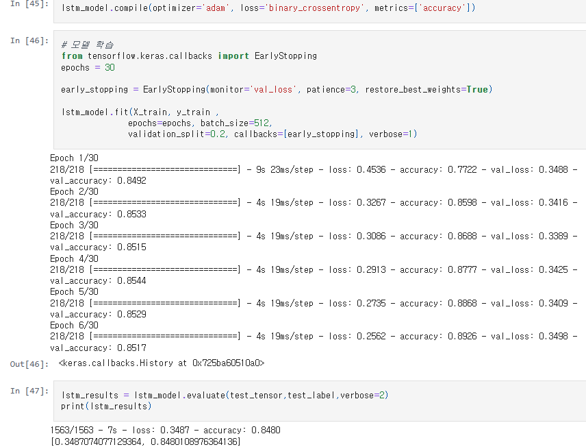
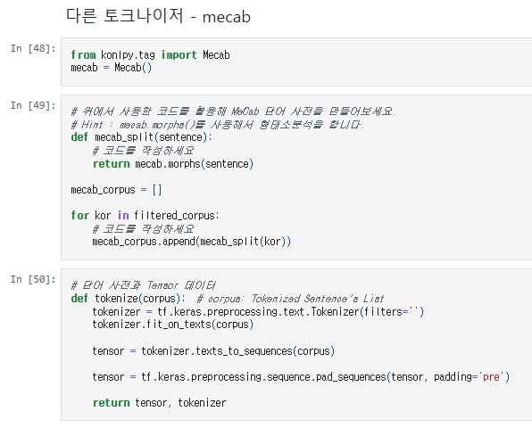

# AIFFEL Campus Online Code Peer Review Templete
- 코더 : 박수연
- 리뷰어 : 임한결


# PRT(Peer Review Template)
- [X]  **1. 주어진 문제를 해결하는 완성된 코드가 제출되었나요?**
    - 문제에서 요구하는 최종 결과물이 첨부되었는지 확인
        - 중요! 해당 조건을 만족하는 부분을 캡쳐해 근거로 첨부
    ---
    
    ---
    
    
- [X]  **2. 전체 코드에서 가장 핵심적이거나 가장 복잡하고 이해하기 어려운 부분에 작성된 
주석 또는 doc string을 보고 해당 코드가 잘 이해되었나요?**
    - 해당 코드 블럭을 왜 핵심적이라고 생각하는지 확인
    - 해당 코드 블럭에 doc string/annotation이 달려 있는지 확인
    - 해당 코드의 기능, 존재 이유, 작동 원리 등을 기술했는지 확인
    - 주석을 보고 코드 이해가 잘 되었는지 확인
        - 중요! 잘 작성되었다고 생각되는 부분을 캡쳐해 근거로 첨부
        
    ---
    
    ---


- [X]  **3. 에러가 난 부분을 디버깅하여 문제를 해결한 기록을 남겼거나
새로운 시도 또는 추가 실험을 수행해봤나요?**
    - 문제 원인 및 해결 과정을 잘 기록하였는지 확인
    - 프로젝트 평가 기준에 더해 추가적으로 수행한 나만의 시도, 
    실험이 기록되어 있는지 확인
        - 중요! 잘 작성되었다고 생각되는 부분을 캡쳐해 근거로 첨부
    
    ---
    
    ---
        
- [X]  **4. 회고를 잘 작성했나요?**
    - 주어진 문제를 해결하는 완성된 코드 내지 프로젝트 결과물에 대해
    배운점과 아쉬운점, 느낀점 등이 기록되어 있는지 확인
    - 전체 코드 실행 플로우를 그래프로 그려서 이해를 돕고 있는지 확인
        - 중요! 잘 작성되었다고 생각되는 부분을 캡쳐해 근거로 첨부

    ---
    
    ---
      
- [X]  **5. 코드가 간결하고 효율적인가요?**
    - 파이썬 스타일 가이드 (PEP8) 를 준수하였는지 확인
    - 코드 중복을 최소화하고 범용적으로 사용할 수 있도록 함수화/모듈화했는지 확인
        - 중요! 잘 작성되었다고 생각되는 부분을 캡쳐해 근거로 첨부
    ---
    
    ---

# 회고(참고 링크 및 코드 개선)
```
# 리뷰어의 회고를 작성합니다.
# 코드 리뷰 시 참고한 링크가 있다면 링크와 간략한 설명을 첨부합니다.
# 코드 리뷰를 통해 개선한 코드가 있다면 코드와 간략한 설명을 첨부합니다.

전처리를 할 때 데이터를 굉장히 잘 분석하셨다는 느낌을 받았습니다! 특히, document와 label의 중복 수준을 점검하는 부분에서 데이터를 깊게 분석하지 못하면 알아차리지 못하는 부분을 잘 캐치하셨고, 좋은 결과로 이어졌다고 생각합니다.

데이터의 글자수가 한 개인 것과 두 개인 것을 직접 추출해서 보는 것이나, 사분위수의 95%만 사용하도록 데이터 범위를 지정한 것도 좋았습니다.
mecab과 komoran을 사용해서 추가실험을 해주셨는데, 처음에는 padding이 중복되어 사용되었거나 사용되지 않은 경우에 성능이 잘 안나올 수 있다라고 말씀드렸습니다. 그런데, 코드에서는 두 부분 다 패딩이 잘 되어있는 걸 확인했고, 이번에는 아마 padding의 maxlen 설정이 문제가 아닐까 생각이 듭니다. tokenize와 sp_tokenize 코드 둘 다 maxlen이 명시가 안 되어 있는데, 이 부분을 한 번 고쳐보고 실험해보시면 좋을 것 같습니다.

tensor = tf.keras.preprocessing.sequence.pad_sequences(tensor, padding='pre', maxlen=40)

```
